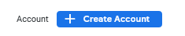
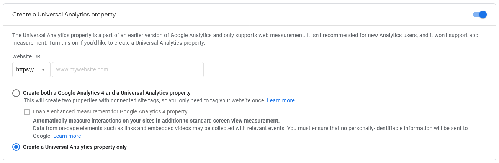
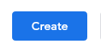
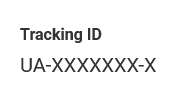
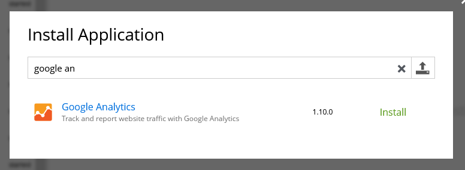
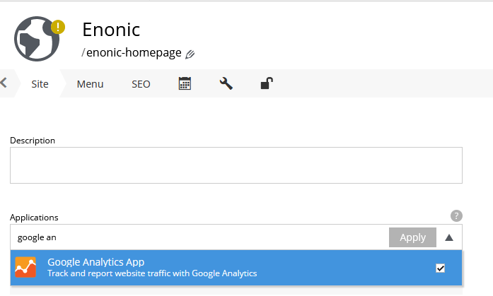
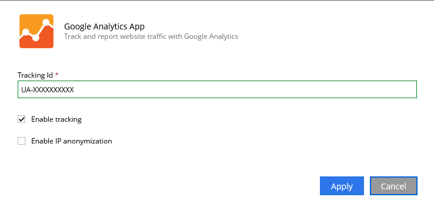

## Create a Google Analytics account:

. Go to https://analytics.google.com and link your google account to google analytics.

. Setup a ccount inside Google Analytics.
+ 
Give your account the name of the organization or another name that represents all sites/pages that will be included.
+

. Add a new property  
.. On the property tab put the name of the site (eks: your-site-name.com) to be analysed into the "Property name" field
+
image::images/ga-02-1.png[Property name field with a placeholder site filled in]
.. open the advanced options:
+

.. This app uses the Universal Analytics property. So select this option:
- Choose: 'Create a Universal Analytics property only': 
+

- Then you can create a new property:
+

. Now we can get the Tracking ID from our newly created property:
+

## Download the analytics app from the market

. Log in to your XP admin and open the Applications tool: 
+
image::images/applications.png["Applications" button in the Enonic dashboard interface]

. Press install button to open up the dialog with the list of all apps from the Enonic Market and use the filter to locate the Google Analytics app.

- When you have found the application you press the green install to add it.
+

- This text should pop up at the bottom:
+

. Application should say installed.

## Add to site
Now we have it installed on the system, but not added to a specific site yet.  

. Navigate to Content Studio and edit **edit** the site you have set up the analytics for.  

. Under the applications dropdown find Google Analytics app and check for it to be used:
+

## Configure the app

We need to configure the app to make Google Analytics work. 

. Open the app configuration:
+

. Add the tracking id (UA-XXXXX) id to the "Tracking id" field inside the configuration pop up:
+

. Press apply to send page data to google analytics (tracking data might be delayed when first activated)

The above steps will add Google Analytics to your site.
We have additional analytics information available in our widget, but this needs to be set up. 

link:widget.adoc[Set up widget]
Setting up the widget includes changes to server configuration files.
