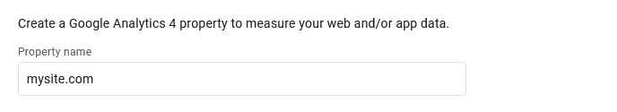
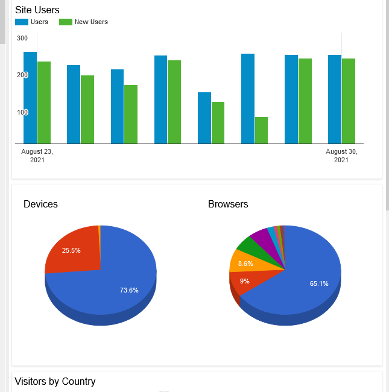
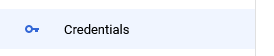
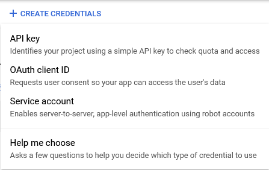
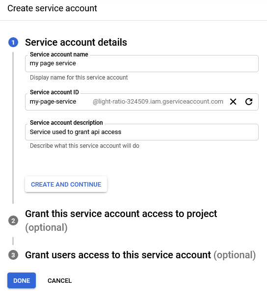
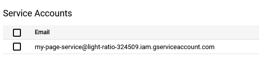
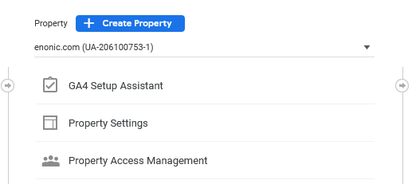
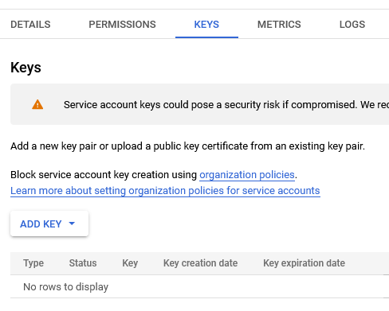

## Set up Google Analytics

. Go to https://analytics.google.com and link your google account to Google Analytics.

. Set up an account inside Google Analytics.
+
Give your account name of the organization or another name that represents all sites/pages that will be included.
+


. Add a new property
.. On the property tab put the name of the site (eks: your-site-name.com) to be analysed into the "Property name" field
+

.. open the advanced options:
+
image::images/ga-02-2.png[Blue button/text "show advanced options", 178, 48]
.. This app uses the Universal Analytics property. So select this option:
- Choose: 'Create a Universal Analytics property only':
+
image::images/ga-02-3.png[Create universal analytics property with the "create a universla Analytics property only" selected, 800]
- Then you can create a new property:
+
image::images/property-create.png[Blue create property button, 125]

. Now we can get the Tracking ID from our newly created property:
+


## Download the analytics app from the market

. Log in to your XP admin and open the Applications tool:
+


. Press Install button to open up the dialog with the list of all apps from the Enonic Market and use the filter to locate the Google Analytics app.

- When you have found the application press the green Install button to add it.
+
image::images/app-install.png[Install application inside the application admin tool, 776]

- This text should pop up at the bottom:
+
image::images/installed-app.png[Pop up showing the Google Analytics app is installed successfully, 800]

. Application should say "Installed".

## Add to site
Now we have it installed on the system, but not added to a specific site yet.

. Navigate to Content Studio and edit the site you want to set up the analytics for.

. In the applications dropdown find the Google Analytics app and select it with a checkbox, then click "Apply":
+
image::images/site-install.png[Content studio site configuration showing the applications dropdown and Google Analytics App selected, 697]

## Configure the app

We need to configure the app to make Google Analytics work.

. Open the app configuration:
+
image::images/app-config.png[Red bar showing the Google Analytics needs additional configuration, 640]

. Add the tracking id (UA-XXXXX) id to the "Tracking id" field inside the configuration pop up:
+
image::images/app-tracking-id.png[Google Analytics configuration: Tracking Id shows a placeholer UA Code, Enable tracking checked, Enable IP anonymization not checked, 738]

. Press Apply to send page data to Google Analytics (tracking data might be delayed when first activated)

The steps above will add Google Analytics to your site.

We have additional analytics information available in our widget, but this needs to be set up.

## Configure the widget

IMPORTANT: Widget setup requires access to server configuration files.

GA widget displays additional information that is provided by Google Analytics:



We will need to set up a Google Cloud platform account.

. link:https://console.developers.google.com/project[Open Google Developers Console] and click Create Project on the dashboard.

- We suggest to use the site or organization name: eg. "site.com", "brand name"
+


. Open the top level menu in the top left and open "APIs & Services" -> Dashboard
+
image::images/Platform-menu-api.png[Shows the top level menu open and the APIs & Services item expanded]

. We want to enable a couple of APIs so press the "+ Enable APIs and services" on the top of the page:
+
image::images/apis-services.png[Show the button labeled "+ Enable apis and services"]

. Search for "Google Analytics Reporting API" using the API Library search.
- It should look like this:
+
image::images/analytics-api.png[Shows The google analytics API in the search result]

. Click the "Enable" button:
+
image::images/analytics-api-enable.png[Shows the analytics API page with an enable button]

. Repeat the same two steps for the Maps JavaScript API
+
image::images/maps-api-enable.png[Shows the Maps JavaScript API with an enable button]

. After enabling Maps JavaScript API go to the "Credentials" tab which should look like this:
+


. Press the "+ Create credentials" button.
+
image::images/Credentials-page.png[A full page view of the credentials tab]

. We want to create an API key:
+


- After creating it make sure to copy it. We will use this value later.

. We also need a Service account. Select this option from the same dropdown as the "API key".

- This will propmt you to create a new Service account.
+


. Give the account the viewer role. Create the new account as the final step.

. After you have created the account you should be brought back to the overview page.
+


. Copy the email of the service account we will need twice later.

  Now that we have created an account we need to give it access to our project.

. Go back to our Analytics page, and the property that you want the APIs to work with.
Then enter the property access management page.
+


- On this page you can add new users and give them access to this property.
. We want to add our Service account to give access to this property
+
image::images/property-new-user.png[Dropdown on the property access page that shows create a new user]

. Now add the service account to the users that have access to the property. It only needs `Read & Analyse` access.
+
image::images/new-user-service.png[A new user form filled in and showing the app button in the top right]

. Go back to the Cloud platform and the service accounts menu option. Press on the service that was created.
+
image::images/service-page-accounts.png[Service accounts in a list]

. On the service find the tab that is called "Keys" and add a new key.
+


. We need to create a new p12 key. This file gives services access, so be careful and share it only with those that need access to it.

. Now for our widget to be set up we need to add this information to our configuration file:
`com.enonic.app.ga.cfg`:

```
ga.serviceAccount = <service-account>
ga.p12KeyPath = ${xp.home}/config/ga_key.p12
ga.mapsApiKey = <maps-api-key>
```

- Where:
`service-account` is the email for our service and
`mapsApiKey` is the maps api key we have created
and the p12 key with the correct name and path. (Need to add the p12 key to the folder too)

That's it. If everything is set up correctly, you should see site stats inside the widget panel when selecting a site in Content Studio and page-speific analytics when selecting a page.
