Our widget show addition information that is provided by google analytics:

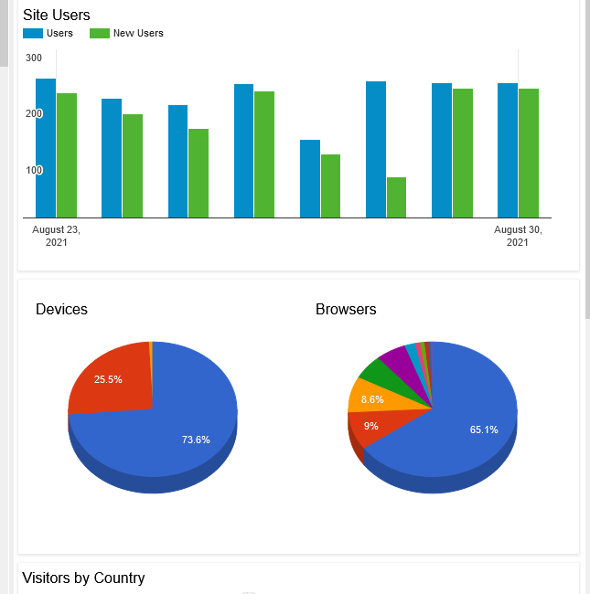

We will need to setup a google cloud platform account. 

* link:https://console.developers.google.com/project[Open Google Developers Console]. 
When you are doing click Create Project on the dashboard.

We suggest to use the site or organization name: eg. "site.com", "brand name" 

image::images/ga_02.png[New project form with placeholder text in the fields]

After creating the project open the top level menu in the top right and open "APIs & Services" -> Dashboard

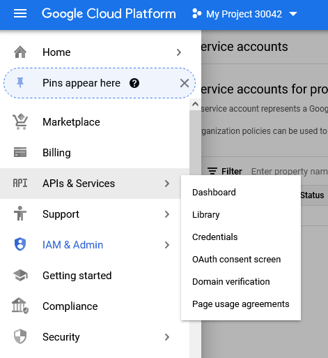

We want to enable a couple of APIs so press the "+ eneable APIs and services" on the top of the page:


On the go api Library search for "Google Analytics Reporting Api". 
It should look like this: 

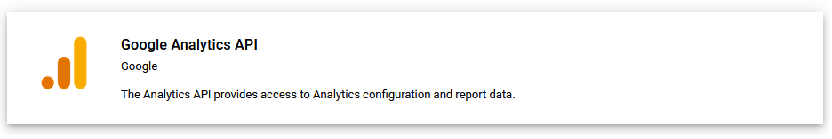

And enable it: 

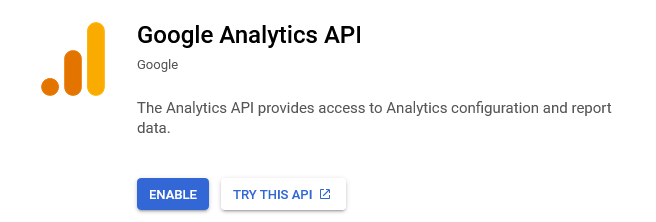

And the same two steps for the Maps JavaScript API

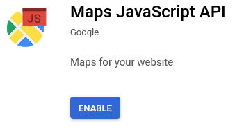

After enabling the Maps JavaScript API go to the credentials tab.

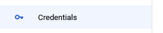

Should look like this:
And press the "+ Create credentials" button. 

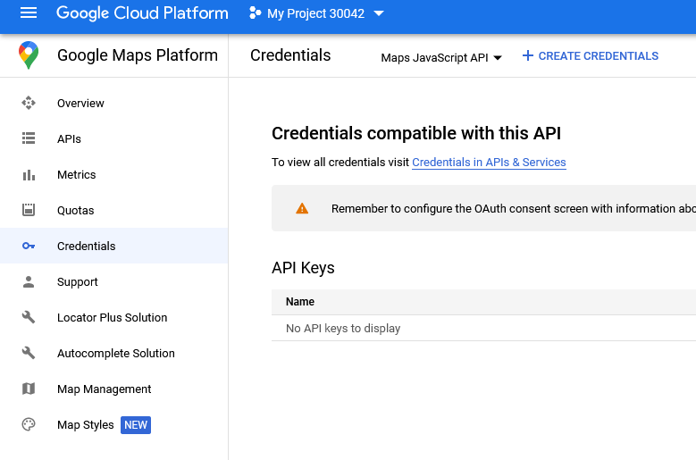

We want to create an api key: 

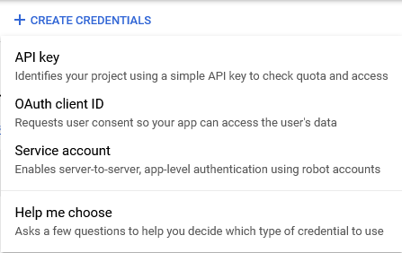

After creating it make sure to copy it. We will use this value later.

We also need a service account. This is created on the dropdown on the above image. 

This will propmt you to create a new service account. Feel free to give this any name. 

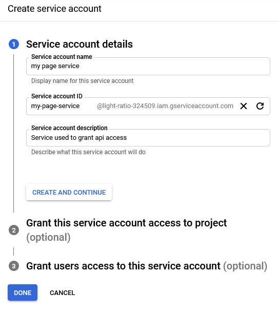

Give the account the viewer role. Create the new account as the final step.

After you have created the account you should be brought back to the overview page.

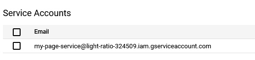

Copy the email of the service account we will need twice later.

Now that we have created an account we need to add give it access to our project.

Go back to our Analytics page, and the property that you want the apis to work with. 
Then enter the property access managment page.

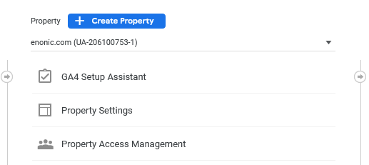

On this page you can add new users and give them access to this property. 
We want to add our service account to give access to this property

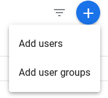

Now add the service account to the users that have access to the property.
It only needs `read & Analyse` access

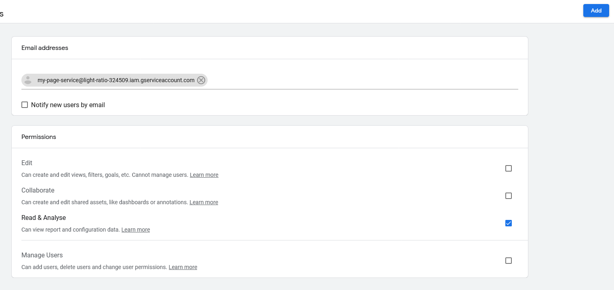

Go back to the cloud platform and the service accounts menu option. Press on the service that was created.

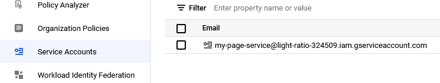

On the service find the tab that is called keys. 
And add a new key. 

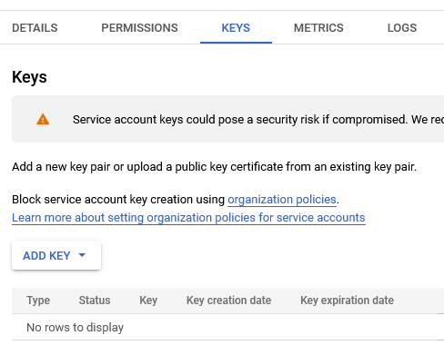

We need to create a new p12 key. This file gives services access, so be careful to not share or send it to others. Only those that need access to it.

Now for our widget to be setup we need to add this information to our configuration file: 
`com.enonic.app.ga.cfg`: 

```
ga.serviceAccount = <service-account>
ga.p12KeyPath = ${xp.home}/config/ga_key.p12
ga.mapsApiKey = <maps-api-key>
```

Where:
 `service-account` is the email for our service and 
 `mapsApiKey` is the maps api key we have created
 and the p12 key with the correct name and path. (Need to add the p12 key to the folder too)

